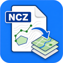

  

# Jeomatik NCZ Reader

**Open NetCAD NCZ files in QGIS without intermediate conversion.**

**Jeomatik NCZ Reader** imports NetCAD NCZ binary drawing files directly into QGIS and converts supported entities into editable QGIS vector layers while preserving geometry and attributes.

> **Copyright © 2026 Erdinç Örsan ÜNAL.**  
> The **Jeomatik** name, logo and associated trademarks remain the property of the author and are **not licensed under the GPL**.

**Version:** `1.4.0`  
**Tested with:** `QGIS 3.22 LTR` and `QGIS 4.0`  
**License:** `GPL-2.0-or-later`

> Sample NCZ files may be included in the source repository for testing purposes but are not distributed with the official release package.

---

## Features

- Import NetCAD NCZ files directly into QGIS
- Create editable QGIS vector layers (Point, Line and Polygon)
- Preserve supported geometry and attributes
- Organize imported features into grouped layer structures
- Support Point, Line, Polygon, Text, Arc, Circle and SmartObject entities
- Automatically select the best available parser backend
- Automatic layer naming with collision handling
- Use the current QGIS project CRS for created layers
- Tested with QGIS 3.22 LTR and QGIS 4.0
- Cross-platform support for Windows and macOS

---

## What It Does

- Adds a **Jeomatik NCZ Reader** button to the QGIS toolbar
- Adds the plugin under **Plugins → Jeomatik → Jeomatik NCZ Reader**
- Reads supported NetCAD NCZ entities
- Converts entities into editable QGIS vector layers
- Uses the current QGIS project CRS when creating layers
- Adds the source NCZ file name to the `source_file` attribute
- Groups imported layers by source file and geometry family

---

## Layer Structure

Imported content is grouped by source file name and geometry family.

Example groups:

- `PP_TEMPLATE_POINT`
- `PP_TEMPLATE_LINE`
- `PP_TEMPLATE_POLYGON`

Generated layer names follow the NCZ layer name and geometry type.

Examples:

- `BINA_POINT`
- `BINA_LINE`
- `BINA_POLYGON`

If duplicate layer names occur after sanitization, unique names are generated automatically.

---

## Supported Geometry

| NCZ Entity | Output |
|------------|--------|
| Point | Point layer |
| Text | Point layer |
| Symbol | Point layer |
| Line | Line layer |
| Polyline | Line layer |
| Arc | Line layer |
| Polygon | Polygon layer |
| Circle | Polygon layer |
| Box | Polygon layer |

Additional handling:

- Circles are approximated as polygon rings.
- Arcs are approximated as line strings.
- Rotated boxes are interpreted using NetCAD's bottom-left corner, rotation angle, width and height.
- Nearly closed multiline entities can optionally be promoted to polygons.

---

## Output Attributes

Every generated layer contains the following attributes:

- `source_file`
- `layer_code`
- `layer_name`
- `entity_type`
- `name`
- `label`
- `color_argb`
- `radius`
- `start_ang`
- `end_ang`
- `text_h`
- `rotation`

---

## Parser Strategy

The plugin automatically selects the best available parser backend for the current platform.

1. Pure Python parser
2. Native Python extension (when available)
3. Native CLI helper (when available)

This architecture provides maximum compatibility across different QGIS versions and operating systems.

---

## Installation

### Install from ZIP

1. Open QGIS.
2. Go to **Plugins → Manage and Install Plugins...**
3. Select the **Install from ZIP** tab.
4. Choose **Jeomatik-NCZ-Reader.zip**.
5. Install and enable the plugin.

### Manual Installation

1. Copy the **NCZReader** folder into your QGIS plugins directory.
2. Start QGIS.
3. Enable **Jeomatik NCZ Reader** from the Plugin Manager.

---

## Usage

1. Click the **Jeomatik NCZ Reader** toolbar button.
2. Select an `.ncz` file.
3. Wait for the import to complete.
4. Review the generated layers in the QGIS Layer Panel.

After a successful import, the plugin reports the parser backend used. Unsupported geometry types, if encountered, are displayed in the QGIS message bar.

---

## Screenshots

### Toolbar

### Import Dialog

### Imported Layers

---

## Product Page

More information is available on the official product page:

https://jeomatik.com/ncz-reader.html

---

## Links

- **Homepage:** https://jeomatik.com/ncz-reader.html
- **Source Repository:** https://github.com/jeomatik/Jeomatik-NCZ-Reader
- **Issue Tracker:** https://github.com/jeomatik/Jeomatik-NCZ-Reader/issues

---

## License

This project is licensed under the **GNU General Public License v2.0 or later (GPL-2.0-or-later)**.

See the **LICENSE** file for details.

---

## Feedback

Bug reports, feature requests and pull requests are welcome.

If Jeomatik NCZ Reader is useful in your projects, your feedback helps improve future releases.

---

Made with ❤️ for the QGIS community by <strong>Erdinç Örsan ÜNAL</strong>

## Author

**Dr. Erdinç Örsan ÜNAL**

Geomatics Engineer • GIS Developer • QGIS Plugin Developer

https://jeomatik.com
